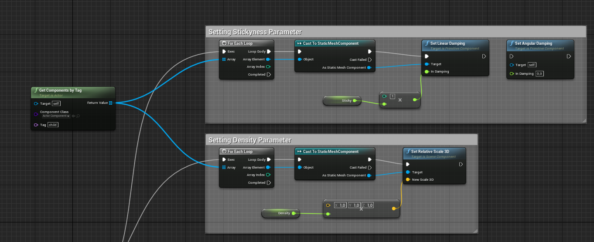
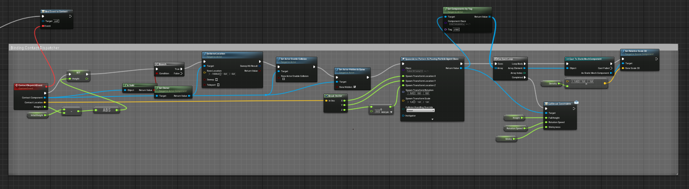
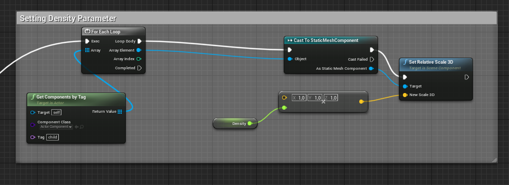
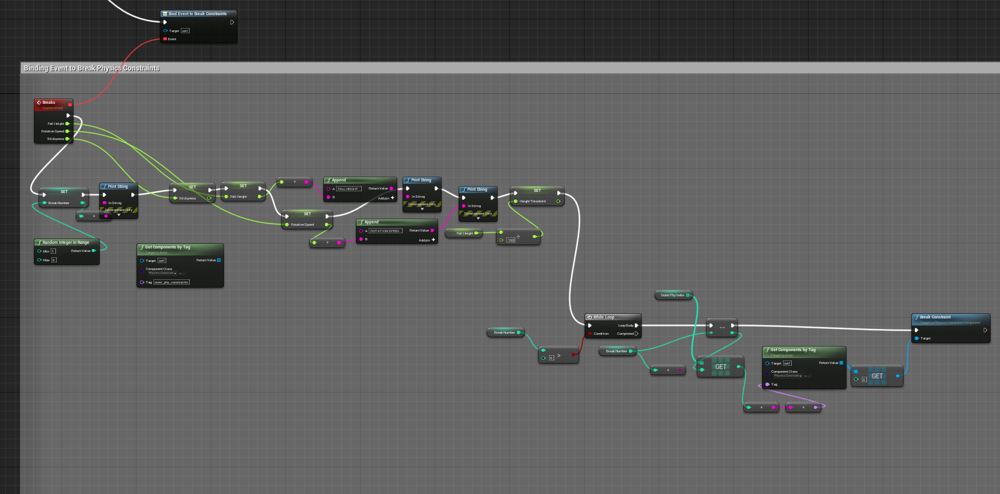
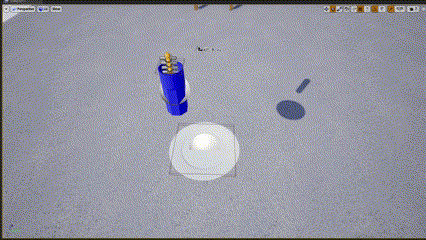

## Creating Pouring a Pattern Effect in RobCoG

### Blueprint Actors
* Three main blueprint actors that are required in the current version of pouring are
  
  * `HoneySLPouringParticleAgentClass`
  * `PatternSLPouringParticleAgentClass`
  * `MyBreakfastPlate`
 
* Another actor blueprint used in this pouring is an event tick cup that rotates at a constant speed up to a constant angle
  * `TickCup`

### Blueprints

**`HoneySLPouringParticleAgentClass`**

  * **Event Begin 1** : Setting the 'Linear Damping' and the 'Scale' of the Honey actor using 'Sticky' and 'Density' variables respectively
 
  

  * **Event Begin 2** : Binding the event `ContactDispatchEvent` to the `Contact` event dispatcher of Honey actor

  

  * **ContactDispatchEvent** performs following actions
  
    * Making the Honey Actor non-existent by setting its location outside play area, disabling its collisions and enabling hidden.
    * Spawns the new actor ('Pattern Actor') at the location(comes as input to `ContactDispatchEvent`) of Honey Actor 
      and sets the density of pattern actor same as honey actor.
    * Calls the event dispatcher `BreakConstraints` of the pattern actor by passing variables (height, rotation speed, sticky).

  * **OnComponentHit (StaticMesh)** : Casts to TickCup actor, if successful retrieves TickCup's rotation speed and location(height) and promotes as variables

 

**`PatternSLPouringParticleAgentClass`**
  
  * **Event Begin 1** : Setting the 'Scale' of self actor using 'Density' variable

  

  * **Event Begin 2** : Binds `Breaks` event to `BreakConstraints` event dispatcher
 
  

  * **Breaks** performs following actions
  
    * Finds the random number to break outer loop constraints and sets variables(coming in as input to the event) like height, speed, sticky
    * Then within a while loop we get the physics constraint component references by tag(a number between 7 and 18 for outerloop) and then breaks it

    
   
**`MyBreakfastPlate`**

  * **OnComponentHit (StaticMesh)** : Casts the component to Honey Actor, if successful calls the `Contact` dispatcher
    by passing the contact location, contact component reference and its location as inputs
    
    .png)

### Usage

  * Place the `HoneySLPouringParticleAgentClass` actor inside a container (eg. `TickCup`) in a level
  * Place the `MyBreakfastPlate` actor in to the same level
  * Have the `PatternSLPouringParticleAgentClass` blueprint actor in the content browser
  * Start the simualtion and try to tilt the container over the break fast plate

  

### ToDo

  * Thicken the `HoneySLPouringParticleAgentClass` by constraining multiple actors in parallel
  * To make outer loop constraint breaking dependent on speed and height of the pouring
